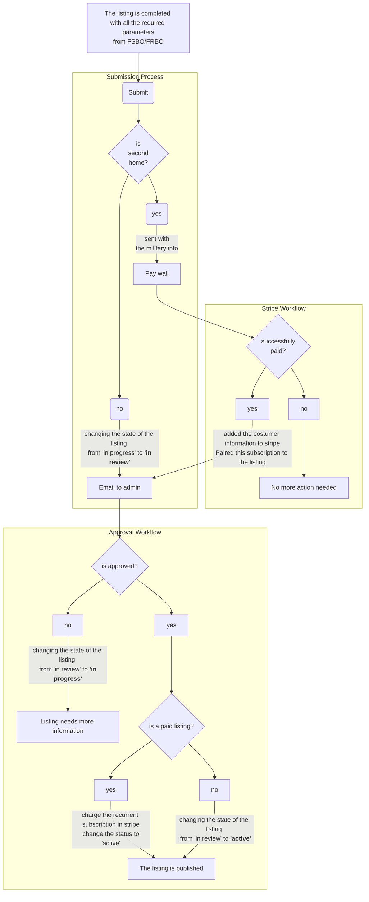
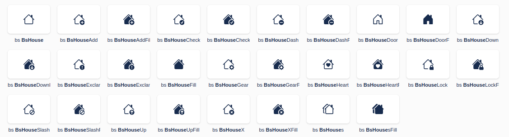

## Description

This document describes the process of a user creating a listing to publish it on the main mls

## Creating a listing

When a draft is just created, it has the **"in progress"** status.
In this status, the user can delete or modify anything in the draft.
During the several forms where the user gets,
there are required parameters.
If the user doesn't provide the *valid values* for the whole section/page,
they can't continue to the next one, at this point.
If a user gets stuck because it doesn't provide the value for a required parameter,
they can **save for later**, and continue at another time when they have the required parameter.
Once the user gets to the last page, instead of a *next* button, they will find a *submit* one.
If they attempt the submission, and it's their first one, the client sends the draft information to the server.
Note: This listing doesn't need to be saved before submitting, because at submission, the draft gets created/updated in
the server.

## Submission of a listing

The whole state management of the listing is done on the server side.
The state gets changed from "in progress" to "in review",
and an email with all the property details gets done and mailed to the admin.
In the email, the admin can **Approve** or **Not Approve** the listing inside the email.

The approval gets verified from the email to the server with a UUID attached to the draft,
and the request should contain the correct UUID and the ID of the draft.

if the draft gets approved, the server converts the draft values to the MLS and creates an active listing.
if the draft is not approved, changes the status from **in review to in progress**,
and allows the user to make the necessary changes to attempt a further submission.

## Stripe integration

When the user attempts the submission of a second listing, stripe should be triggered.
At this point, if the user meets all the conditions for the submission,
after clicking the submission button,
the UI provides a feedback dialog announcing that this submission needs to be paid.
After that, if they proceed to click the checkout button,
the session should be redirected to a stripe checkout,
for 1 recurrent subscription.
Note: this behavior will occur for all the submissions that are not the first.

### If the checkout was successful

- The draft continues the same regular lane, changes the status from "in progress" to "in review" and the email to the
  admin gets created and sent.
- A subscription license gets created on db, this entity links the listing - user - subscription all together.

### If the checkout was not successful

Nothing happens, the draft still with the "in progress" status,
ready for another submission and if applicable again, another checkout attempt.



## Veteran / Military disclosure

The Stripe subscription has already a coupon option, with the 50% of discount,
so then a user is eligible for this discount, that coupon should be applied to their subscription.
In the future, if this value is in db, this action should be automatized at the moment of the checkout.

## Assumptions

- We should have active subscriptions for the user,
  then the user can swap and change the listing within their houses.
  This implies that we should pair the subscription id and the expiration time with the listing in the MLS.
- The user owns a list of subscriptions, and they can pair them with their houses. The info of the subscriptions
  should be kept in the server.
- We should write the validity of the listing in the global MLS.
  And rewrite that value everytime a new subscription is paired with the listing.
- We need to set up an icon with the status of the subscription, and should be next to the **active** label in the
  listing section. Here are some options: 
- In the user's dashboard, there should be a section with the information and manipulation of the subscription. The user
  should
  be able to cancel subscriptions here.
- if a specific subscription can't be charged from the stripe side, the listing that has attached that subscription
  should be changed to inactive.
- When globally our apps search/display a listing, should check if it comes from FSBO, then check the validity of the
  subscription, if not, this listing should be hidden from these results.

### Schemas
#### Licence Schema

```properties
  _id=string
valid=number
user=string
```

#### Subscription License

```properties

```

### Subscription Schema

### Draft Schema

## Challenges - next steps

- To keep up with the validity of the subscription from the stripe side (in case stripe try to charge but there are
  problems).
- Dynamic changes when pairing the subscriptions with the houses.
- When the user gets validated as military, attach this to stripe, so they applied the discount automatically, instead
  of having different payments amounts. This makes easier to manage inside the stripe portal.
